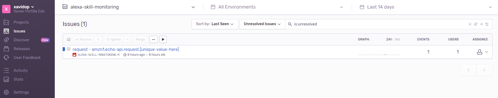
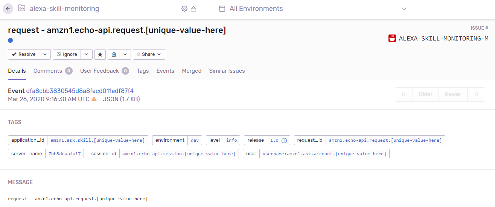
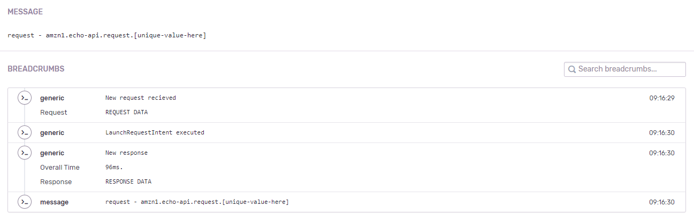
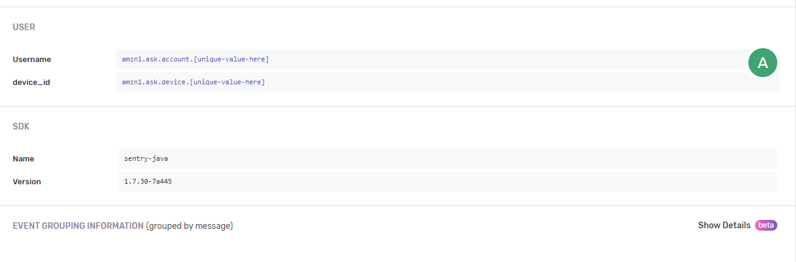
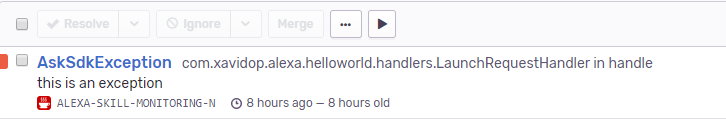
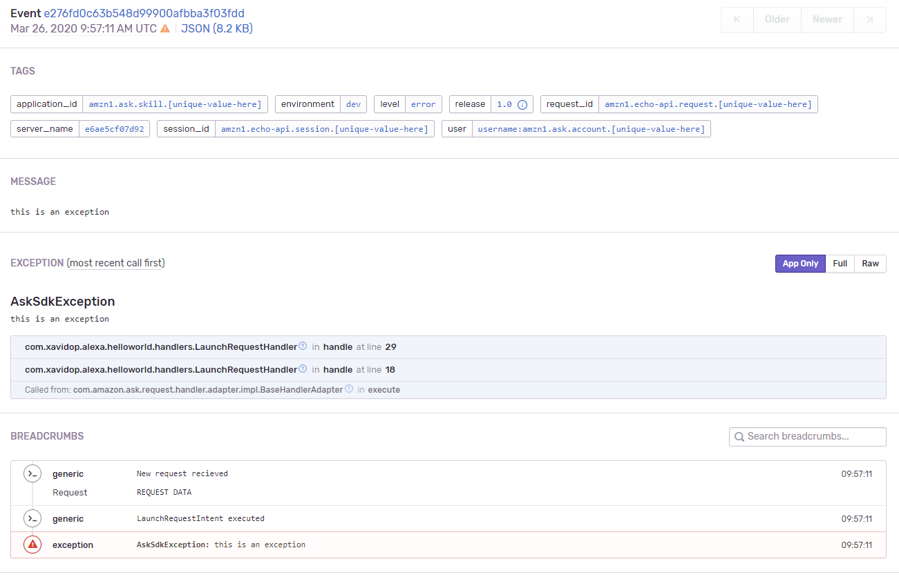
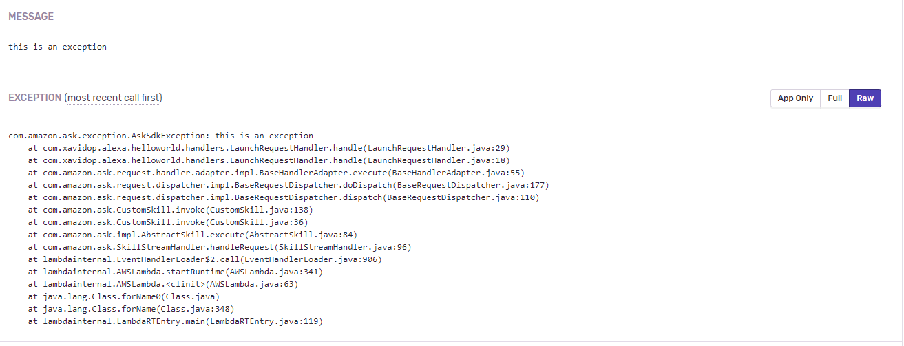

# How to monitor your Alexa Skill

Software debugging is an essential capability for developers, but debugging serverless architectures requires a dedicated approach. 
The backend of an Alexa Skill is in most cases serverless functions, using for example AWS Lambda.
Debugging, monitoring and testing are the top challenges when it comes to serverless, with debugging being the most common challenge. 

Serverless functions are, by design, very hard to attach anything to. 
As a result, we’re witnessing new solutions for debugging serverless, both locally and remotely. 
In this post, I present a solutions monitoring your Alexa Skills along. 


## Monitoring the insides of our skill 

Our Skill Backend by nature is event-driven. This makes debugging harder as minor differences in the event content, format, or ordering can make big differences. 
Simulating those events is potentially a big difference that can make it harder to reproduce and test.

When facing a bug in a Skill, reproducing it reliably can be half the battle. In many data-driven environments, the main factor in actually reproducing the bug is getting the right input data. 
Migrating data from production to development can easily take hours (or even days) and may be hampered by security, compliance and other considerations. 
Production debugging tools allow developers to study the bug ‘in the wild’ in production without wasting time and resources on data migration, and without exposing sensitive data. 

There are a lot of tools that help us to debug and monitor serverless applications. 
Making a previous study looking for which one will be better to monitor an Alexa Skill, I've chosen [Sentry](https://sentry.io)

Let's go deeper!

## Sentry

[Sentry](https://sentry.io) is an open-source company, providing an application monitoring platform that helps you identify issues in real time. 
Sentry fundamentally is a service that helps you monitor and fix crashes in real time. 
The server is in Python, but it contains a full API for sending events from any language, in any application.
We are going to focus on Sentry concepts of [Context](https://docs.sentry.io/enriching-error-data/context/), [breadcrumbs](https://docs.sentry.io/enriching-error-data/breadcrumbs/) and [environments](https://docs.sentry.io/enriching-error-data/environments/) to make a proper monitoring of our skill.


### Contexts
Sentry supports additional context with events. Often this context is shared among any event captured in its lifecycle, and includes the following components:

Which contexts are we going to use? these ones:
* **User**: the user of the alexa requests
* **Tags**: it allows us to classify and contextualize every request in order to monitor and track all requests well. We will set up this tags:
    * **request_id**: the id of the request received.
    * **application_id**: the id of our skill. It allows us to make a quick search to check all the requests of one skill.
    * **session_id**: the id of the session of one user using one skill. It will help us to track a single session of one user.
    * **person_id**: with personalization, your skill can distinguish between individual speakers in the account. So if Alexa recognize the current voice we will receive the `User` and `Person` objects which includes the `person_id` property.
  
### Environments
With environments we can filter events depending of the environment of execution i.e dev/prod and depending as well of the release of our skill backend.
You can filter releases by which environment they’ve been deployed to. 
For example, a release linked to a QA deploy and a Prod deploy will appear in your view when filtering by QA as well as Prod.

### Breadcrumbs
Sentry supports a concept called Breadcrumbs, which is a trail of events which happened prior to an issue. 
Often times these events are very similar to traditional logs, but also have the ability to record more rich structured data.
In these breadcrumbs we will put relevant data of our Alexa Skill such as requests (contexts, session), responses, overall time of execution, etc.

## Sentry in our Skill

I am not going to start from the scratch in this post. I will reuse the project I have used in my post [Alexa Skill, AWS CloudFormation y Serverless Application Model (SAM)](https://xavidop.github.io/alexa/2020-03-15-alexa-lambda-cloudformation-sam/)

### Setting up Sentry in our Skill

First of all, what we have to add is the Sentry dependency in the `pom.xml` file:

```xml
        <dependency>
            <groupId>io.sentry</groupId>
            <artifactId>sentry</artifactId>
            <version>1.7.30</version>
        </dependency>
```

After that we need to initialize the Sentry client. I intialize it at the same time the lambda is called with the method `Sentry.init();`:

```java 
    public class App extends SkillStreamHandler {
    
        private static Skill getSkill() {
            //SENTRY INITIALIZATION
            Sentry.init();
            return Skills.standard()
                    .addRequestHandlers(
                            new CancelandStopIntentHandler(),
                            new HelloWorldIntentHandler(),
                            new HelpIntentHandler(),
                            new LaunchRequestHandler(),
                            new SessionEndedRequestHandler(),
                            new FallbackIntentHandler(),
                            new ErrorHandler())
                    .addExceptionHandler(new MyExceptionHandler())
                    .addRequestInterceptors(new LogRequestInterceptor())
                    .addResponseInterceptors(new LogResponseInterceptor())
                    // Add your skill id below
                    //.withSkillId("[unique-value-here]")
                    .build();
        }
    
        public App() {
            super(getSkill());
        }
    
    }
```

When `Sentry.inti()` is called it will read the `sentry.properties` resource file which have the following properties:
* **dsn**: the unique URL of your Sentry project. You can get it online in your Sentry project. For example: ttp://fasdfasd@sentry.io/asdfas
* **release**: to make a better monitoring of our skill, it is good to have this property set in order to filter when something happen.
* **environment**: it is also important to set because of to know the current environment of execution. E.g.: dev, prod.
* **stacktrace.app.packages**: the java package you want to monitor. In our case `com.xavidop,alexa.helloworld`

### Sentry in our Skill Interceptors

After adding the dependency, now we are going to focus on our two interceptors. `LogRequestInterceptor` and `LogResponseInterceptor`. 
Why those two? 
* In `LogRequestInterceptor` we have the request received which have all the information we need in order to create our Sentry User and  Sentry tags to monitor the current request:
```java
     public class LogRequestInterceptor implements RequestInterceptor {
     
         static final Logger logger = LogManager.getLogger(LogRequestInterceptor.class);
         @Override
         public void process(HandlerInput input) {
             TimeUtilities.start = new Date().getTime();
             HashMap<String, String> data = new HashMap<String,String>();

             //SETTING RELEVANT TAGS TO MAKE SEARCHES IN SENTRY
             Sentry.getContext().addTag("request_id", input.getRequestEnvelope().getRequest().getRequestId());
             Sentry.getContext().addTag("application_id", input.getRequestEnvelope().getSession().getApplication().getApplicationId());
             Sentry.getContext().addTag("session_id", input.getRequestEnvelope().getSession().getSessionId());
     
            
            //SET EXTRA USEFUL DATA FOR THE BREADCRUMB
             data.put("Request", input.getRequestEnvelope().getRequest().toString());
             data.put("context", input.getRequestEnvelope().getContext().toString());
             data.put("Session", input.getRequestEnvelope().getSession().toString());
             data.put("Version", input.getRequestEnvelope().getVersion());
     

             //CREATING THE USER OF THIS REQUEST FOR A FUTURE SEARCHES
             HashMap<String, Object> userData = new HashMap<String,Object>();
             userData.put("device_id",input.getRequestEnvelope().getContext().getSystem().getDevice().getDeviceId());
             Sentry.getContext().setUser(
                     new UserBuilder()
                             .setData(userData)
                             .setUsername(input.getRequestEnvelope().getSession().getUser().getUserId()).build()
             );
     
             Sentry.getContext().recordBreadcrumb(
                     new BreadcrumbBuilder()
                             .setLevel(Breadcrumb.Level.DEBUG)
                             .setTimestamp(new Date())
                             .setData(data)
                             .setMessage("New request recieved").build()
             );
     
             logger.info(input.getRequest().toString());
         }
     }
```
* In `LogResponseInterceptor` we have here the response we are going to send and we can calculate the time in milliseconds od the current execution. 
As these are the last lines of our skill during the execution, one of the main tasks of this interceptor is to send all the Sentry event to the cloud with the method `Sentry.capture()`. 
Finally, we clean everything with `Sentry.clearContext()` for future Alexa requests:
```java
public class LogResponseInterceptor implements ResponseInterceptor {

    static final Logger logger = LogManager.getLogger(LogRequestInterceptor.class);
    @Override
    public void process(HandlerInput input, Optional<Response> output) {
        TimeUtilities.end = new Date().getTime();
        HashMap<String, String> data = new HashMap<String,String>();

        //GET THE RESPONSE AND PUT IT AS DATA OF THE BREADCRUMB
        data.put("Response", output.get().toString());

        //GET THE TIME OF THE EXECUTION
        long time = TimeUtilities.end - TimeUtilities.start;
        data.put("Overall Time", String.valueOf(time) + "ms.");

        //CREATE A BREADCRUMB WITH THE INFO OF THE RESPONSE
        Sentry.getContext().recordBreadcrumb(
                new BreadcrumbBuilder()
                        .setLevel(Breadcrumb.Level.DEBUG)
                        .setTimestamp(new Date())
                        .setData(data)
                        .setMessage("New response").build()
        );

        Sentry.capture("request - " + Sentry.getContext().getTags().get("request_id"));
        //CLEAN CONETXT FOR NEW REQUESTS
        Sentry.clearContext();;

        logger.info(output.toString());
    }
}
```

### Logging in our Skill with Sentry

One of the most important tasks in a serverless arquitecture is the log. It is essential to know what had happened during an execution.
In this example we will use an auxiliary Class called `LogUtilities` which have only one method `log(String toLog)` this method has two tasks:
1. Log using log$j2 or lambda4j libraries to have a structured log files.
2. Create a Sentry breadcrumb that will be added to the rest of the breadcrumbs and will be available in our Sentry console as part of the event generated by the request. 
It will help us to track what has happened in a request. 

So with this class you can call it wherever you want in order to lag and add your breadcrumbs. It will help you to monitor and have a good tracking of your skill.

### Catching exceptions in our Skill with Sentry

The last but not the least, when we are talking about monitoring, are the exceptions.

In our Alexa Skill we have one place to catch all the Exceptions. The `MyExceptionHandler` is our exception handler.
When we have an exception, the `LogResponseInterceptor` is not going to be executed. So, this is why here we capture the exception with Sentry and we clean its context as well:

```java
public class MyExceptionHandler implements ExceptionHandler {
    @Override
    public boolean canHandle(HandlerInput input, Throwable throwable) {
        return throwable instanceof Exception;
    }

    @Override
    public Optional<Response> handle(HandlerInput input, Throwable throwable) {
        //CAPTURING THE EXCEPTION
        Sentry.capture(throwable);
        //CLEANING CONTEXT
        Sentry.clearContext();

        return input.getResponseBuilder()
                .withSpeech("An error was encountered while handling your request. Try again later.")
                .build();
    }
}
```

### The power of Sentry

Now we have set our Skill with Sentry. Let's send an Alexa request to its backend to see what happened and then we will check the Sentry console:

WOW!!, we have a new entry!



Now click on the item and let's see what is inside:



Here you have the information of the event: time of the Alexa request was sent and all the tags. Every Tag is clickable in order to filter depending on your needs.  

If we scroll down, we will see the breadcrumbs. It means a quick view of what happened during that Alexa request:



NOTE: The data of the request and response have been removed for this example.

And then if we continue scrolling down we will see the User (Alexa username and Alexa device) information and the information about the Sentry SDK used.




If we have an exception, we can see in Sentry Dashboard as well:



And we can also see all the execution information clicking on the event:



You can see the full stacktrace clicking on the Raw button:



Before concluding this topic, I would like to add that with Sentry you can make searches of any tag, user, environment, release you have.

For example:
* Give me all the Alexa requests that came from one user and one skill:
    * request_id:amzn1.echo-api.request.[unique-value-here] application_id:amzn1.ask.skill.[unique-value-here] 
* Give me all the Alexa requests that came from one session:
    * session_id:amzn1.echo-api.session.[unique-value-here] 
* Give me all the Alexa requests that came from current release:
    * release:XXX
    
You can save these searches as a quick ones and it will be available in one click.
 
## Conclusion

With the help of Sentry, we quickly went from having zero knowledge to understanding the error. Using the right tools at the right time can help tremendously with these kinds of issues.

I've made this example in Java but you can use it in ohter languages that Alexa supports because Sentry is available in a lot of programming languages such as NodeJS, Python, Java, Kotlin, C#, PHP, Ruby, Go, iOS Android, etc.

You can take a look to all the Sentry documentation [here](https://docs.sentry.io/)

Regarding the pricing, Sentry has a developer plan that comes with 5.000 events per month. In our case, 5.000 Alexa requests from our Skill. You can see plans [here](https://sentry.io/pricing/)